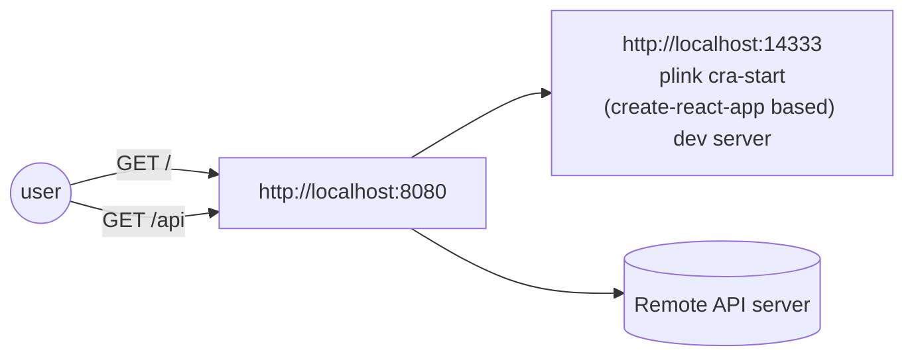

- A static assets server for production demonstration
- An API proxy server for workaround CORS in development mode without Browser hacking

```mermaid
flowchart LR

user((user)) --> |GET /| proxy["http://localhost:8080"]

proxy --> devServer["http://localhost:14333<br>plink cra-start<br>(create-react-app based) dev server"]

user --> |GET /api| proxy 
proxy --> remote[(Remote API server)]
```
